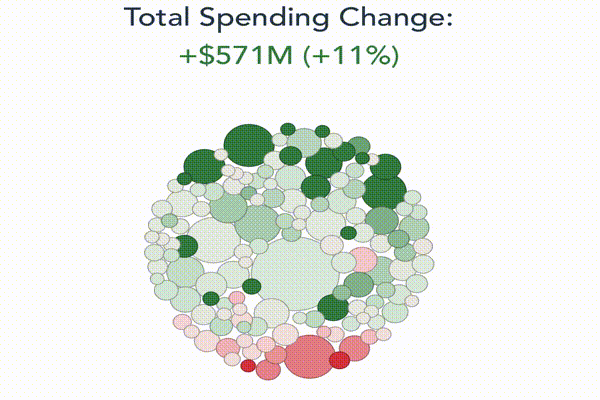

# Visualizing the City of Philadelphia's Budget

The code behind the interactive visualization of Philadelphia's budget. There are visualizations for multiple
versions of the budget:

- [The Adopted FY23 Budget](https://controller.phila.gov/philadelphia-audits/the-adopted-fy23-budget/), approved by City Council on June 23, 2022.
- [The Proposed FY23 Budget](https://controller.phila.gov/philadelphia-audits/the-proposed-fy23-budget/), proposed by the mayor on March 31, 2022.
- [The Proposed FY22 Budget](https://controller.phila.gov/philadelphia-audits/the-proposed-fy22-budget/), proposed by the mayor on April 15, 2021.
- [The Adopted FY22 Budget](https://controller.phila.gov/philadelphia-audits/the-adopted-fy22-budget/), approved by City Council on June 24, 2021.




## Tools

The application is built using a combination of open-source tools, including
[vue](https://github.com/vuejs/vue) and [d3](https://github.com/d3/d3).

## Development

### Project setup
```
yarn install
```

### Compiles and hot-reloads for development
```
yarn run serve
```

### Compiles and minifies for production
```
yarn run build
```
